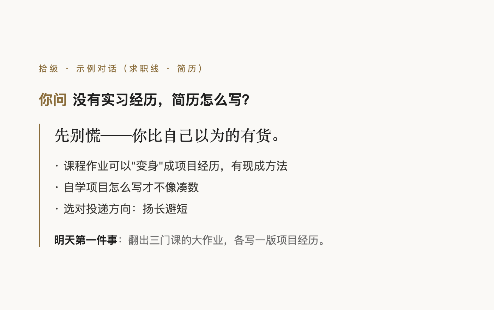

# 拾级 · 从校园到工位的军师

> 「拾级聚足，连步以上。」——《礼记·曲礼》

**装进你 AI 里的一位"过来人"**——从大一第一次和室友闹别扭，到入职后第一次向领导汇报：
人际关系、学习方法、毕业论文、考研、留学、求职、职场，**你问什么，它答什么。**

> 在线预览（不用装，先看看）：**https://ZhongQuinnKing.github.io/shiji/** ｜
> English: [README_EN.md](README_EN.md)

**怎么用（30 秒）**：把它装进 **Claude、豆包等 AI 助手** → 直接说话——
"帮我做一份简历""室友半夜打游戏怎么办""导师怎么选"。不用记指令，不用自报身份。



**现在有什么**（先挑几个说——剩下的留给你自己挖）：

- **求职线全套**：简历十四篇 + **八套免费可打印模板** + 面试 / 谈薪 /
  **三方协议与五险一金怎么看** / 专科与高职求职
- **人际关系**：宿舍矛盾、师生相处、交朋友——还有一份"心理学理解层"（看懂"为什么"）
- **考研线**：要不要考、择校（五大核心数据）、复试、给导师的邮件怎么写、
  **推免保研全流程**、**专升本**
- **高考线**（新增）：选科、平行志愿与退档机制、冲稳保、专业怎么选、
  强基综评专项、本科线附近与复读
- **大学线**（新增）：绩点怎么保、转专业与辅修、评奖评优、学业预警、
  大类分流、竞赛大创、医保与体测
- **考公线**（新增）：国考省考选调的区别、选岗、行测、申论、公考面试、
  政审体检、三支一扶与军队文职
- **职场线**：入职合规与劳动合同、转正与绩效、社保与权益、
  一线岗位（车间·门店·仓配）
- **还有**论文（含**毕业后抽检**与艺术类毕业创作）、学习、读研、生活
  （含**毕业第一次租房**）、四六级、读博、留学申请与留学生活……以及
  **特殊通道与少数处境**（入伍与兵役登记、残疾学生、港澳台侨、预科与民族班、在职学历）

——**从高三到工位，十二条线全部开通**，装进去自己探索。

- 全部免费、**没有会员墙**；内容按"逐句案例 + 研究依据"的标准写作，持续加深

- 不需要你自报身份——从你问的话里，它就知道你在哪个阶段、卡在哪里
- 记得你——聊过的处境和目标，下次接着聊
- 有底线——该拒绝的会拒绝，拿不准的会直说（见下"红线"）

> **English TL;DR** — A mentor skill for AI assistants, covering the journey from
> college to career: relationships, study, thesis, grad-school entrance, job
> hunting (resume/interview/offers), graduate life and the workplace. Ask
> anything; it figures out your situation from the question itself.

## 它怎么工作

1. 你随意问（"室友半夜打游戏怎么办""导师怎么选""简历怎么改"）——
   它判断问题属于哪一块，读对应的知识，给你**能落地的下一步**
2. 记住你的处境（轻档案：你是谁、在烦什么、想去哪）——不审问，聊到了就记
3. 先接住情绪，再给干货；有立场，但选择权永远还给你

## 现在能用什么（各线明细）

> **最快的一条路**：直接说一句"**帮我做一份简历**"——它会访谈式地问你十几分钟，
> 然后直接产出成品（HTML 一键打印成 PDF），**从零到能投，一杯咖啡的时间**。

- **简历十四篇**：结构与版面 / 经历怎么写 / 分经历类型 / 没实习怎么办 /
  技能栏与自我评价 / 针对岗位定制 / 自查清单 / 特殊去向 / 投递细节 /
  可填骨架 / 正例逐条点评 / 让 AI 帮你改 / 字体与排版细节 / 英文写作手册
- **八套简历模板（免费）**：极简通用 / 国企稳重 / 外企英文 / 创意岗 /
  技术岗 / 教师教育岗 / 实习申请版 / 学术复试版——
  浏览器打开、打印即 PDF，**全部免费，没有会员墙**
- **投递追踪表（免费）**：单文件离线小工具——投了哪家、到哪一步、
  什么时候该跟进，一屏管住；数据存本机浏览器，可导出 CSV
- **求职策略**：校招时间线 · 渠道 · 分层投递 · 找实习
- **面试四篇**：自我介绍与高频问题 / 行为面试与 STAR / 群面 / 模拟演练与复盘
- **谈薪与 offer** ＋ 求职期心态

第二批（已上线）：

- **职场线十篇**：前 90 天 / 向上管理 / 协作沟通 / 会议 / 冲突与自保（含 PUA 识别）/
  难相处的人 / 加薪与晋升 / 跳槽时机 / 职场心理 ＋
  一份"**理解层**"（交换与依赖、信号、心理安全、组织政治、动机、情绪劳动——
  看懂局，再动手）
- **人际关系六篇**：宿舍 / 同学与小组作业 / 师生 / 社团 / 交朋友 ＋
  一份"**理解层**"（归因偏差、边界、非暴力沟通、课题分离……看清机制，再动手）
- **专业与行业四层**：三大行业重点（技术工程 / 商科体制 / 文教医法）·
  单位类型导览（国企/互联网/外企/银行/体制内…）· 专业关键词库（21 个专业）·
  **JD 逆向法**（把招聘要求变准备清单——专业重点的"活"来源）

第三批（已上线）：

- **论文线十二篇（全周期）**：全流程地图（六段流水线、倒排时间表）/
  选题（小题大做、老题新作、题目三要素打磨）/ **文献检索**（知网高级检索手把手、
  同义词扩展实战、滚雪球法）/ 开题报告与开题答辩（七件套逐节讲）/
  **研究方法**（量化质化两族、问卷/访谈/案例操作要点、选法对照）/
  数据与分析（清洗、统计选择对照表、质性编码入门）/ 结构写作（摘要四句话、
  烂初稿哲学、卡壳急救）/ 规范格式（GB/T 7714 实例、Word 实操）/
  查重降重（正当四法、**2026 AIGC 检测应对**）/ 答辩（资格关、成绩构成、六类问答）/
  与导师相处（汇报三段式、被批怎么接、导师失联怎么破）/ **毕业设计（工科版）**/
  案例集·论文全程（八则翻车现场与救援）

第四批（已上线）：

- **考研线九篇**：全流程地图（时间轴、三根"错过等一年"的红线、推免窗口）/
  要不要考（成本收益的真实账、二战怎么算）/ **择校择专业**（五大核心数据、
  "黑校"信号、冲稳保梯度、政策风向年核）/ 备考规划（全年倒排、跨考额外账）/
  **报名与初试实务**（报考点三原则、**抢报考点的操作与满了怎么办**、往届生社保倒推、
  填错补救表、报名与确认一体化、考场当天、**拟录取之后**）/
  复试与调剂（分数线四线术语、"不会的问题"标准答法）/ **选导师**（怎么挑、
  怎么打听、邮件七段式模板）/ **推免（保研）全流程**（资格评定、加分细则、专项通道、
  夏令营脱钩后的新形态、预推免、九推填报、保研失败转考研）/
  **专升本**（各省独立体系、备考、录取后的身份变化与两年制衔接）

第五批（已上线）：

- **学习线六篇**：学习的科学（五大有效方法+证据分级）/ 方法实操（间隔·提取·交错·
  费曼、康奈尔笔记）/ 复习与考试（错题本四类错因、考前七天、考试焦虑）/
  用 AI 学习（正确姿势与红线）/ 拖延与专注（最小启动、环境设计）/ **四六级与英语**
  （按分值分配、精听五步、考场技巧）
- **研究生线五篇**：三年节奏（含奖学金打法）/ 科研入门（文献三遍读法、组会模板、
  科研工具箱）/ 开题与小论文（投稿与审稿回复、学术会议）/ **读博与申博**
  （申请-考核制、研究计划、套磁）/ 和导师相处（期望差管理、边界）

第六批（已上线）：

- **留学线十篇（申请→留学全周期）**：全流程地图（各国"节奏差"）/
  去哪（国家对比、选校梯度）/ 雅思与托福 / 申请材料（文书三件套、中介防坑）/
  钱与签证行前 / **落地第一学期**（生存手续、文化冲击四阶段）/
  海外怎么学（**office hours**、学术诚信铁律）/ 生活与安全（打工纪律、
  领事保护 12308）/ 博士生存（本科-硕士-博士三档对照）/ 毕业去向（留下·回国·继续读）
- **求职线增补四篇**：出身与打法（**本硕博 × 学校层次**）/ 海归回国求职
  （认证、时间线错位、落户红利）/ 城市怎么选（五笔账算法）/ 分专业节奏
  （各专业大类的特有节点）
- **总图**：升学与就业地图（四条路速览 × 四根轴 × 特殊通道——含专科/专升本、
  专项计划、公费定向、助学体系）

第七批（已上线）：

- **高考线八篇**：全流程与时间轴 / 新高考选科 / **志愿填报规则**（平行志愿、
  院校专业组、**投档与退档机制**、服从调剂） / 冲稳保与位次法 /
  专业怎么选（就业数据怎么读才不被注水骗） / **特殊通道**（强基、综评、三大专项、
  艺考、体育单招、军校警校、公费师范） / 本科线附近与专科选择、复读决策 /
  中外合作办学与港澳高校
- **大学线八篇**：大学的规则（绩点怎么算怎么保、培养方案怎么读、选课、四年节点表）/
  转专业与辅修双学位 / 评奖评优与综测 / 学业危机处理（挂科、预警、休学）/
  大类分流与二次选拔 / 竞赛与大创 / 医保与在校就医 / 体测与免测
- **考公线八篇**：全流程（国考省考选调的区别、**应届身份怎么用**）/ 选岗
  （备注栏对不上就出局、竞争比怎么估）/ 行测 / 申论 / **公考面试**（与企业面试
  打法是反的）/ 政审体检与录用 / 基层与编外渠道（三支一扶、西部计划、
  社区工作者、军队文职）/ 报名与资格审核实务
- **特殊通道与少数处境五篇**：入伍与兵役登记（学费补偿、退役升学红利、
  加分与专项计划二选一）/ 残疾学生（合理便利怎么申请、定向渠道）/ 港澳台侨学生 /
  预科与民族班 / 在职学历（**2025 秋起"函授""业余"统一改称"非脱产"**）
- **总纲新增**：信息与信源（检索式怎么写、信源分级、交叉验证、向人打听的姿势）
- **各线同步增补**：求职（三方协议与五险一金、专科与高职求职）· 职场
  （入职合规与劳动合同、派遣与外包、**第一份工资的账**、转正与绩效、
  **一线岗位**、社保与权益、灵活就业）· 论文（中期检查、评阅与盲审、
  **毕业不等于结束——抽检**、艺术类毕业创作与展演）· 留学（背景提升与轻留学、
  艺术类作品集）· 学习（分学科的学习法、课堂与资源）· 研究生（发表与署名、
  同门与实验室、研究生的求职日历）· 生活（**毕业第一次租房**、助学贷款还款、
  已婚有娃的手续、把"要办的手续"排进日历）

**十二条线（高考 / 大学 / 考研 / 考公 / 求职 / 职场 / 论文 / 研究生 /
留学 / 学习 / 人际与生活 / 特殊通道），从高三到工位，已全部开通**
——内容永远在成长。

## 安装

**豆包等 AI 助手用户——两条路，挑最顺的走**

**路径一 · 口令安装（最省事）**

在豆包里直接说这一句，它自己就装好了：

> 请把 https://github.com/ZhongQuinnKing/shiji 下载并安装为技能

（这条依赖网络能访问 GitHub；国内网络不便的话走路径二）

**路径二 · 拖拽安装（最直观，国内推荐）**

1. 下载 ZIP 并解压出一个文件夹：GitHub 页面的 Code 按钮 → Download ZIP
2. 打开豆包电脑版 → 侧边栏「技能·连接器·伙伴」→「我的技能」→「新建」→「上传技能」
3. 把整个文件夹拖进去——完成

**Claude Code / Codex 等命令行 AI**

```bash
git clone https://github.com/ZhongQuinnKing/shiji ~/.claude/skills/shiji
```

**其他一线 AI（ChatGPT / Kimi / 通义 / 元宝 / 智谱 / Gemini / DeepSeek…）**：
见 [安装指南.md](安装指南.md)——建个知识库/智能体，上传相关篇章文件（按线挑），
配一句启动指令即可用。

**装好之后怎么用**

直接说话就行："帮我做一份简历""室友总是半夜打游戏怎么办""导师怎么选"——
它自己知道该干嘛。不用记任何指令，也不用先说你是谁。

装好想验收一下？拿 **`自测题.md`** 考它（14 道题，每题都写了"合格的样子"和对应的规则条目）；
内容有问题随时提 issue（有 30 秒反馈模板）。

## 它在你设备上留下什么（透明说明）

- **一共就一个文件夹**：豆包是上传制（拖进去即入云端技能库，本地只剩你自己下载的那个包）；
  命令行环境是 clone 到 skills 目录下的一个文件夹——不会散落到别处
- **运行中只产生两样**：你要的简历文件（HTML/PDF）＋ 你同意的档案（记着你的处境，
  随时可看、可删；不要档案＝零残留）
- **不装软件、不开后台进程、不改系统设置、不写系统目录**——删掉那个文件夹＝卸载干净
- **不收集、不上传**：技能包本身不收集对话内容、不向任何服务器回传数据；
  你的简历、档案等文件只存在你本机。（AI 助手平台自身的数据政策由该平台负责——
  这与本技能包无关，但值得你了解。）

## 红线（它永远不做的事）

- 论文只教方法、**绝不代笔**；不帮写作业、不参与考试作弊
- 法律只做常识与渠道指引，不接个案、不写文书
- 心理疏导可以、诊疗不做；危机情况明确引导求助
- 不做"帮我查某个人"；不碰防诈类内容
- 不涉政治、宗教、违禁、群体对立
- 恋爱话题只指路成熟资源，不展开

## 诚实原则

拿不准的直说"这块我不确定"；政策与考情有时效，会提醒你核实最新——**绝不硬编**。

## 状态


十二条线已全部开通（详见上）；每篇都按"准/深/全"标准持续加深。
覆盖口径：**没碰红线、不违规的，就该在库里**——受众差异轴（学历、学校层次、
国内外、地区、专业门类、人生阶段、特殊身份）逐轴对过表。

**遇到问题？** 先看 [常见问题（FAQ）](docs/FAQ.md)——装机、更新、时效、隐私、
边界、参与方式都在里面；想提问或交流去
[Discussions](https://github.com/ZhongQuinnKing/shiji/discussions)；
要纠错、投稿走 [issues](https://github.com/ZhongQuinnKing/shiji/issues/new/choose)。

## License（双轨许可）

- **内容与文档**（参考文献篇目、模板、预览页等）：**CC BY-NC-ND 4.0**
  （署名—非商业性使用—禁止演绎）——
  **自己用、自己改（不发布不分享）：完全自由**（无需授权、无需标注）；
  **阅读、学习、原样分享：免费**（署名即可）；
  **修改后再发布/分享/宣传（非商业）**：**必须先取得授权**
  （教育公益等善意场景一般免费放行）——没有"标注即可发布"的替代路径；
  **商业使用（无论是否修改）**：**必须事先联系我们沟通议价并取得书面授权，
  未获授权一律禁止**。
  授权洽谈：本仓库提 issue（选「许可申请」模板），标题注明【商用授权】或【改编授权】。
- **代码脚本**（`scripts/`）：MIT。
- "拾级"名称与品牌不随许可授予。
- 全文见 [LICENSE](LICENSE)（CC BY-NC-ND 4.0 法律文本）与 [NOTICE.md](NOTICE.md)（中文四档说明）。

---

## 姊妹篇

同一个家族的另外两个免费开源项目（配合使用更完整）：

- [采诗](https://github.com/ZhongQuinnKing/caishi) —— 中文互联网能力包：
  让 AI 直连抖音 / B站 / 小红书 / 微博 / 知乎 / 公众号等 33+ 个中文平台
- [夜诵](https://github.com/ZhongQuinnKing/yesong) —— 离线信息哨兵：
  AI 睡着时替你盯世界（热榜 / GitHub 动态 / Hacker News），零成本、不调大模型

名字同出一源：《汉书·礼乐志》"乃立乐府，采诗夜诵"——采诗去读，夜诵去守，
拾级陪你从校园走到工位。

## 关于内容与版权

本技能内容为原创撰写：方法、流程与常识类信息综合公开资料整理，全部以自己的
语言重写、无逐篇搬运；案例为教学化虚构或改编，不指向任何真实个人；
引用的事实与数据以公开信息为准。如认为某处内容需要署名、更正或删除，
欢迎提 issue，我们会尽快处理。
